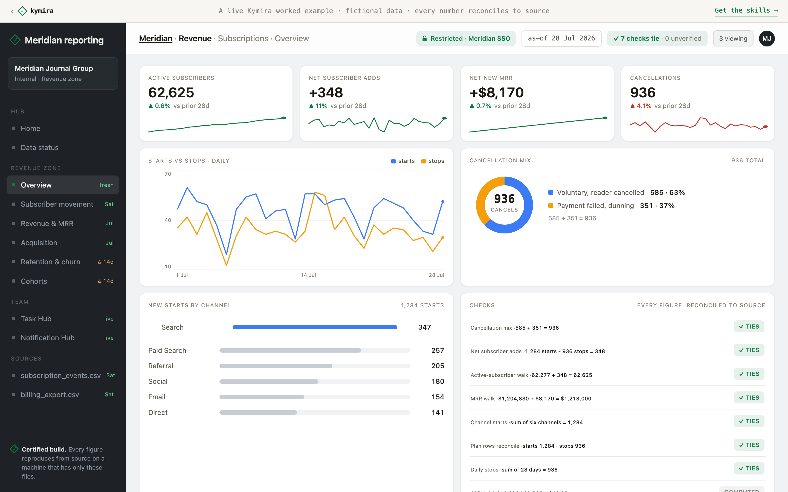

# Claude skills for business intelligence, certified

A free, production-hardened skill and the full certified-BI doctrine from [Kymira](https://kymira.ai). They teach Claude Code and Cursor to build business intelligence where **every number reconciles to the file's own totals**, and anything the file cannot prove is named on the page instead of shipped as a number.

[](https://kymira.ai/demo/)

*A [live demo report](https://kymira.ai/demo/) built with the full skill set: every check ties to the file it came from, on fictional data.*

## What's in this repo

- **[`honest-dataviz/`](honest-dataviz/SKILL.md)**, the free skill: charts and dashboards that read at a glance, survive a colour-blind reviewer, and never imply more certainty than the data has. Every rule in it was bought with a measured failure in a production reporting engine. None is taste.
- **[`DOCTRINE.md`](DOCTRINE.md)**, the eleven principles of certified BI, published in full. The one-sentence version: reconcile every figure to what the source asserts about itself, and refuse to guess, out loud.
- **[`INSTALL.md`](INSTALL.md)**, install in about a minute. Claude Code, Cursor, or any agent with a system prompt.

## Install

```bash
git clone https://github.com/dylnbaker15/claude-skills-for-business-intelligence.git
mkdir -p ~/.claude/skills
cp -R claude-skills-for-business-intelligence/honest-dataviz ~/.claude/skills/
```

Start a fresh Claude Code session and ask "which skills do you have available?" For Cursor and other agents, see [INSTALL.md](INSTALL.md).

## Try it with one prompt

Drop a real export from your business into a project that contains `DOCTRINE.md`, then:

> Here is a raw export from my business: [the file]. Read DOCTRINE.md and use the honest-dataviz skill, then build me a single-file HTML dashboard from this export. Rules: every figure must reconcile to totals the file itself asserts, show the reconciliation, and if the file cannot prove a number, name that on the page instead of shipping it. Refuse to guess.

The difference shows up immediately: the agent hunts for what the file asserts about itself before it types a single figure, and tells you what it cannot prove.

No export handy? [`sample-data/`](sample-data/) holds a fictional subscription export with three planted traps (a repeating invoice total, a 100x price slip, and a "Q2" filename hiding July rows). Run the same prompt against it; the README in that folder has the spoilers and the reconciled figures.

## Why "certified"

A model on its own writes a clever first draft, confident everywhere: it guesses a total when the file states none, and presents every figure with equal confidence. These skills came from building a real reporting system that was broken on purpose across thirteen audit rounds and rebuilt until it stopped shipping a single number it could not prove. The doctrine in this repo is that system's constitution.

## The full toolkit

This repo is the free tier. The full [Kymira](https://kymira.ai) packs add twenty more skills (verification and anchoring, hostile vendor exports, contested metrics, certified exports and decks, a secure team intranet and its co-pilot), a 351-definition [Metric Library](https://kymira.ai/library/) with the fork and the trap in every metric, and a 47-shape [Format Library](https://kymira.ai/library/formats/) of real vendor exports. One-time purchase, lifetime updates.

- [The live demo](https://kymira.ai/demo/), a working intranet where every figure reconciles
- [Your first week](https://kymira.ai/first-week.html), day by day from raw exports to the report your team runs on
- [The doctrine](https://kymira.ai/doctrine.html) and [the roadmap](https://kymira.ai/roadmap.html)

## Notes

- If you later install a Kymira pack, remove this copy of the skill first; the pack ships its own namespaced version (`kymira-honest-dataviz`) and two copies will both try to trigger.
- Updates to the free skill land in this repo. Watch the repo to hear about them.
- Everything in this repo is [MIT licensed](LICENSE).
